# Hi there 👋

## About me

- I am a Automotive Software Development Engineer in China 🇨🇳.
- I use C++ and TypeScript as my main development languages.
- I am interested in runtime, compiler and language tooling related development.
  - [Assemblyscript](https://www.assemblyscript.org/)
  - [LLVM](https://github.com/llvm/llvm-project)

## My Technical Stack

      

## My Github

>)

