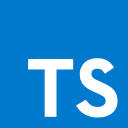

# Hi there 👋

## About me

- I am an Automotive Software Development Engineer in China 🇨🇳.
- I use C++ and TypeScript as my major development languages.
- I am interested in runtime, compiler and language tooling related development.
  - [Assemblyscript](https://github.com/AssemblyScript/assemblyscript)
  - [LLVM](https://github.com/llvm/llvm-project)

### Expreience

- maintainer of [Assemblyscript](https://github.com/AssemblyScript/assemblyscript) (2023.09 - now)
  - next generation assemblyscript with more features and better performance (https://github.com/wasm-ecosystem/warpo)
- maintainer of [clang-tidy](https://clang.llvm.org/extra/clang-tidy/) in LLVM-projects (2024.11 - now)
- AOT compiler for WASM (https://github.com/wasm-ecosystem/wasm-compiler)
  - compile and execute WASM module in resource limited embedded device
  - balance between compilation speed and optimize level
  - portable to bare metal
- data collection platform based on WASM on embedded systems
  - knowledge about embedden device
  - real time operation system

## My Technical Stack

      

## My Github

